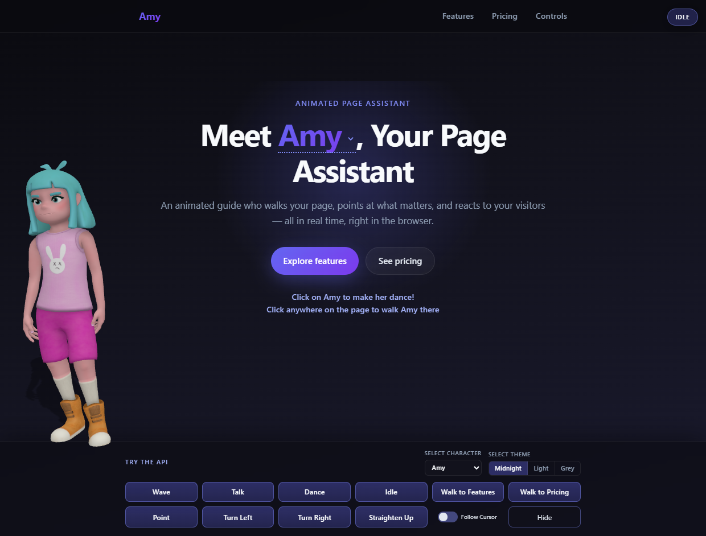
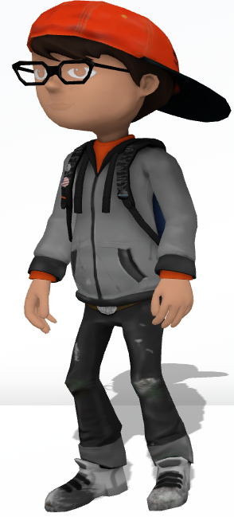
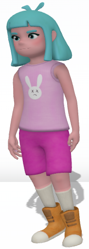
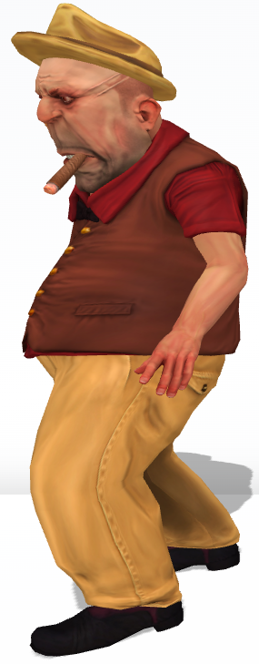
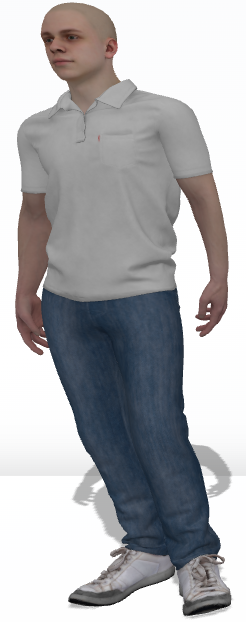
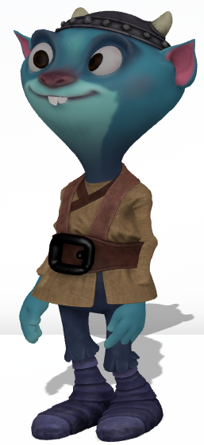
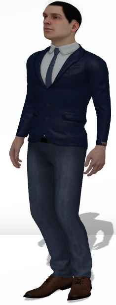
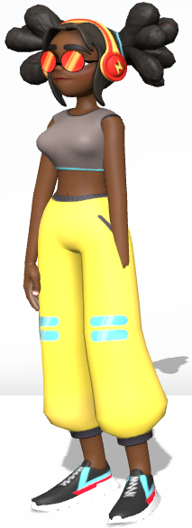
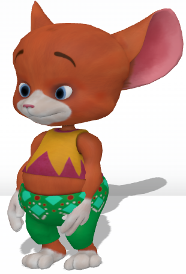
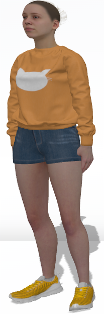

# Page Assistant

An animated 3D character that lives on your webpage — walking, pointing, dancing, and reacting to visitors in real time, right in the browser.

Built with **React**, **Three.js**, and **React Three Fiber**.



**Live demo:** [pagecompanion.web.app](https://pagecompanion.web.app/)

## Features

- **Walk anywhere** — click any spot on the page and the character walks there, scrolling if needed
- **Walk to elements** — programmatically guide the character to any DOM element by selector
- **Gestures** — wave, point, talk, and dance animations with configurable duration
- **Point at elements** — IK-driven arm pointing at any DOM element, screen coordinates, or selector (auto-picks left/right arm based on relative position)
- **Guided tour** — JSON-driven multi-step tours that walk the character between elements, play actions, display speech bubbles, and optionally narrate each step with text-to-speech
- **Text-to-speech** — narrate any text via the Web Speech API with configurable voice preferences (language, gender, neural/online quality) and chunked utterance support
- **Speech bubble** — floating UI bubble anchored to the character's head with title, description, and optional listen/stop controls; auto-flips near viewport edges
- **Lip sync** — jaw bone animates open/closed while speech is playing for a visual talking effect
- **Head tracking** — the character follows the user's cursor with head, neck, and spine bone overrides
- **Cursor follow with arms** — optional arm IK that reaches toward the pointer in addition to head tracking
- **Look at elements** — direct the character's gaze toward a specific element
- **9 characters** — Amy, Sophie, Michelle, AJ, Boss, Brian, Doozy, Joe, and Mousey (Mixamo rigs, optimized GLB)
- **3 themes** — Midnight (dark), Light, and Grey, controlled via CSS custom properties
- **Container mode** — embed the assistant in a sized container instead of the default full-viewport overlay
- **Full API** — a React hook (`usePageAssistant`) exposes walk, gesture, look, speech, tour, visibility, and event methods
- **Accessibility** — respects `prefers-reduced-motion` and provides a `reducedMotion` prop
- **Responsive** — adjusts camera and layout for mobile viewports; tours hide the bubble on small screens when auto-speak is active

## Characters

<table>
  <tr>
    <td align="center"><br /><b>AJ</b></td>
    <td align="center"><br /><b>Amy</b></td>
    <td align="center"><br /><b>Boss</b></td>
    <td align="center"><br /><b>Brian</b></td>
    <td align="center"><br /><b>Doozy</b></td>
  </tr>
  <tr>
    <td align="center"><br /><b>Joe</b></td>
    <td align="center"><br /><b>Michelle</b></td>
    <td align="center"><br /><b>Mousey</b></td>
    <td align="center"><br /><b>Sophie</b></td>
    <td></td>
  </tr>
</table>

## Tech Stack

| Layer | Technology |
|-------|------------|
| UI | React 19, TypeScript 5.9 |
| 3D | Three.js 0.183, React Three Fiber 9, Drei 10 |
| Build | Vite 8 |
| Hosting | Firebase Hosting |

## Getting Started

### Prerequisites

- Node.js 20+
- npm

### Install

```bash
npm install
```

### 3D Assets

Character models start as **Mixamo FBX files** and are converted to optimized **GLB** files for runtime use. The conversion merges 7 FBX files per character into a single compressed GLB (typically 99%+ size reduction).

#### Step 1 — Download from Mixamo

Go to [mixamo.com](https://www.mixamo.com) (requires an Adobe account). For each character, download **7 FBX files** — one base mesh and six animations.

**Base mesh (T-Pose):**

1. Search for and select the character (e.g. "Amy").
2. Download with: Format **FBX Binary (.fbx)**, Pose **T-Pose**, **With Skin**.

**Animations (6 clips):**

For each animation below, search Mixamo, preview it on your character, then download with: Format **FBX Binary (.fbx)**, **Without Skin**.

| File name | Mixamo search term | Notes |
|-----------|-------------------|-------|
| `<char>-idle.fbx` | "Breathing Idle" or "Happy Idle" | Looping. Subtle breathing/weight shift. |
| `<char>-walk.fbx` | "Walking" | Looping. **"In Place" must be checked.** |
| `<char>-point.fbx` | "Pointing" or "Pointing Gesture" | One-shot. Arm extended forward. |
| `<char>-wave.fbx` | "Waving" | One-shot. Greeting gesture. |
| `<char>-talk.fbx` | "Talking" or "Explaining Gesture" | Looping. Hands move as if explaining. |
| `<char>-hiphop.fbx` | "Hip Hop Dancing" | Looping. Fun/easter-egg dance. |

**Download tips:**

- Always select your character first so the preview confirms the animation works with their rig.
- For the Walk clip, ensure **"In Place"** is checked — the character's legs animate but the root stays stationary (translation is controlled in code).
- Adjust the **Arm Space** slider if arms clip through the body on any animation.
- Use 60 FPS (Mixamo default). Do not reduce to 30.

**Rename** downloaded files to match the naming convention and place them under `public/mixamo_files/<character>/`:

```
public/mixamo_files/<character>/
  ├── <character>-tpose.fbx      ← With Skin
  ├── <character>-idle.fbx       ← Without Skin
  ├── <character>-walk.fbx       ← Without Skin, In Place
  ├── <character>-point.fbx      ← Without Skin
  ├── <character>-wave.fbx       ← Without Skin
  ├── <character>-talk.fbx       ← Without Skin
  └── <character>-hiphop.fbx     ← Without Skin
```

Characters: `amy`, `sophie`, `michelle`, `aj`, `boss`, `brian`, `doozy`, `joe`, `mousey`.

#### Step 2 — Convert FBX to GLB

The conversion script merges all 7 FBX files into a single optimized `.glb` and writes it to `public/models/`.

```bash
# Convert a single character
npm run convert-model -- amy

# Convert all characters at once
npm run convert-model
```

**What the script does:**

1. Converts each FBX to a temporary GLB via [FBX2glTF](https://github.com/facebookincubator/FBX2glTF)
2. Loads the base character mesh (T-Pose with skeleton and textures)
3. Merges all 6 animation clips into the base document, matching bones by name
4. Resamples keyframes (removes redundant 60fps frames)
5. Deduplicates accessors and textures
6. Prunes unused resources
7. Quantizes vertex data (positions, normals, UVs)
8. Compresses textures to WebP at target resolution
9. Applies meshopt compression on geometry and animation data
10. Writes the final `.glb` to `public/models/<character>.glb`

**Tuning parameters:**

Edit `buildCharacterConfig()` in `scripts/convert-mixamo.ts` to adjust conversion settings:

| Parameter | Default | Description |
|-----------|---------|-------------|
| `textureSize` | `1024` | Max texture dimension in pixels. Lower to `512` for smaller files (mobile). |
| `textureFormat` | `'webp'` | `'webp'` for smallest size, `'png'` if WebP causes visual issues. |
| `compressionLevel` | `'medium'` | Meshopt level: `'low'`, `'medium'`, or `'high'`. Higher = smaller but slower to encode. |
| `keepIntermediate` | `false` | Set to `true` to also write an uncompressed GLB for debugging in [glTF Viewer](https://gltf-viewer.donmccurdy.com). |

**Debugging conversion issues:**

- Set `keepIntermediate: true` and inspect the uncompressed GLB at https://gltf-viewer.donmccurdy.com
- Check that bone names match between the base mesh and animation files (they should if all files came from the same Mixamo character)
- The script logs channel counts per animation; if a clip shows 0 channels, the bone name mapping failed

### Development

```bash
npm run dev
```

Opens a local Vite dev server (default `http://localhost:5173`).

### Build

```bash
npm run build
```

Outputs a production bundle to `dist/`.

### Deploy

```bash
npm run build
firebase deploy --only hosting:pagecompanion
```

Or use the included script:

```bash
build-deploy.bat
```

## Usage

Wrap your app with `PageAssistantProvider` and use the `usePageAssistant` hook to control the character:

```tsx
import { PageAssistantProvider, usePageAssistant } from './components/PageAssistant';

function App() {
  return (
    <PageAssistantProvider characterId="amy">
      <MyPage />
    </PageAssistantProvider>
  );
}

function MyPage() {
  const assistant = usePageAssistant();

  return (
    <div>
      <button onClick={() => assistant.walkTo('#pricing')}>Walk to Pricing</button>
      <button onClick={() => assistant.pointAt('#signup', { walkTo: true })}>Point at Signup</button>
      <button onClick={() => assistant.wave()}>Wave</button>
      <button onClick={() => assistant.dance()}>Dance</button>
      <button onClick={() => assistant.lookAtCursor()}>Follow Cursor</button>
      <button onClick={() => assistant.say('Welcome to our site!')}>Speak</button>
      <button onClick={() => assistant.startTour({
        steps: [
          { element: '#features', action: 'walkTo', popover: { title: 'Features', description: 'Check out what we offer.' } },
          { element: '#pricing', action: 'pointAt', walkTo: true, popover: { title: 'Pricing', description: 'Affordable plans for everyone.' } },
        ],
        speechEnabled: true,
        autoSpeak: true,
      })}>Start Tour</button>

      <section id="features">...</section>
      <section id="pricing">...</section>
    </div>
  );
}
```

## API Reference

The `usePageAssistant()` hook returns a `PageAssistantAPI` object:

### Movement

| Method | Description |
|--------|-------------|
| `walkTo(target, options?)` | Walk to a DOM element or CSS selector. Scrolls the page if needed. |
| `walkToPosition(screenX, screenY, options?)` | Walk to screen coordinates. |
| `setPosition(screenX, screenY)` | Snap to a screen X position instantly. |

### Gestures

| Method | Description |
|--------|-------------|
| `wave(options?)` | Play the wave animation (one-shot). |
| `point(options?)` | Play the point animation (one-shot). |
| `pointAt(target, options?)` | Point at a DOM element, selector, or `{x, y}` screen coordinates using IK arm aiming. `options.walkTo` walks to the element first. |
| `talk(options?)` | Play the talk animation (looping). |
| `dance(options?)` | Play the dance animation (looping). |
| `idle()` | Return to idle. |

### Orientation

| Method | Description |
|--------|-------------|
| `turnLeft()` | Rotate the character to face left. |
| `turnRight()` | Rotate the character to face right. |
| `straightenUp()` | Reset rotation to face forward. |

### Look

| Method | Description |
|--------|-------------|
| `lookAt(target)` | Turn head/neck/spine toward a DOM element or selector. |
| `lookAtCursor()` | Follow the user's cursor with head tracking. |
| `followCursorWithArms()` | Follow the cursor with head tracking **and** IK arm reaching. |
| `stopFollowingCursorWithArms()` | Stop arm following (head tracking continues if active). |
| `lookForward()` | Reset head to look forward. |

### Visibility

| Method | Description |
|--------|-------------|
| `show()` | Show the character. |
| `hide()` | Hide the character. |
| `isVisible` | Read-only — whether the character is visible. |

### Events

| Method | Description |
|--------|-------------|
| `onStateChange(callback)` | Subscribe to state changes. Returns an unsubscribe function. |
| `onClick(callback)` | Subscribe to clicks on the character. Returns an unsubscribe function. |
| `onHover(callback)` | Subscribe to hover state changes. Returns an unsubscribe function. |

### Speech

| Method | Description |
|--------|-------------|
| `say(text, options?)` | Speak text aloud using the Web Speech API. Plays the talk animation and animates the jaw while speaking. |
| `stopSpeaking()` | Stop any in-progress speech. |
| `getAvailableVoices()` | Return the list of `SpeechSynthesisVoice` objects available in the browser. |

### Speech Bubble

| Method | Description |
|--------|-------------|
| `showBubble(data)` | Display a speech bubble anchored to the character's head with `title`, `description`, and optional `showPlayButton`. |
| `hideBubble()` | Hide the speech bubble. |

### Guided Tour

| Method / Property | Description |
|-------------------|-------------|
| `startTour(config)` | Start a guided tour. The character walks between elements, performs actions, shows speech bubbles, and optionally narrates each step. |
| `nextStep()` | Advance to the next tour step (skips any remaining hold time). |
| `prevStep()` | Go back to the previous tour step. |
| `restartTour()` | Restart the tour from step 1. |
| `stopTour()` | Stop the tour and return to idle. |
| `isTourActive` | `boolean` — whether a tour is currently running. |
| `currentTourStep` | `number` — zero-based index of the active step. |
| `tourStepCount` | `number` — total number of steps in the active tour. |

### State

| Property | Type | Description |
|----------|------|-------------|
| `currentState` | `AssistantState` | One of `idle`, `walking`, `pointing`, `pointingAt`, `waving`, `talking`, `dancing`, `hidden`. |
| `isFollowingCursor` | `boolean` | Whether cursor tracking is active. |
| `isFollowingWithArms` | `boolean` | Whether arm IK cursor tracking is active. |

### Options

```typescript
interface WalkOptions {
  speed?: number;
  onArrive?: () => void;
}

interface GestureOptions {
  duration?: number;
  returnToIdle?: boolean;
}

interface PointAtOptions extends GestureOptions {
  walkTo?: boolean;       // walk to the element before pointing
}

interface SpeechOptions {
  voice?: string | VoicePreference;
}

interface VoicePreference {
  lang?: string;           // BCP 47 language tag, e.g. "en-US"
  gender?: 'male' | 'female';
  quality?: 'neural' | 'online' | 'any';
  name?: string;           // exact SpeechSynthesisVoice.name override
}
```

### Tour Configuration

```typescript
interface TourConfig {
  steps: TourStep[];
  animate?: boolean;           // enable walk animations between steps (default true)
  showSpeechBubble?: boolean;  // show bubble for all steps (default true)
  speechEnabled?: boolean;     // enable TTS for all steps
  autoSpeak?: boolean;         // auto-play TTS when each step starts
  defaultVoice?: string | VoicePreference;
  onStart?: () => void;
  onComplete?: () => void;
  onStepChange?: (stepIndex: number, step: TourStep) => void;
  onDestroyed?: () => void;
}

interface TourStep {
  element?: string;            // CSS selector for the target element
  action?: 'walkTo' | 'pointAt' | 'wave' | 'talk' | 'dance' | 'idle';
  popover?: { title?: string; description?: string };
  duration?: number;           // hold time in ms (auto-calculated from speech or text length if omitted)
  walkTo?: boolean;            // for pointAt action: walk to the element first
  voice?: string | VoicePreference;   // per-step voice override
  speechEnabled?: boolean;     // per-step TTS override
  autoSpeak?: boolean;         // per-step auto-speak override
  showSpeechBubble?: boolean;  // per-step bubble override
  onHighlighted?: () => void;
  onDeselected?: () => void;
}
```

## Provider Props

| Prop | Type | Default | Description |
|------|------|---------|-------------|
| `characterId` | `string` | `'amy'` | Character to render (see characters list above). |
| `containerMode` | `boolean` | `false` | Render in a sized container instead of full-viewport overlay. |
| `width` | `string \| number` | — | Container width (when `containerMode` is `true`). |
| `height` | `string \| number` | — | Container height (when `containerMode` is `true`). |
| `className` | `string` | — | CSS class for the canvas wrapper. |
| `initiallyVisible` | `boolean` | `true` | Whether the character is visible on mount. |
| `reducedMotion` | `boolean` | `false` | Disable the assistant entirely (also respects `prefers-reduced-motion`). |

## Project Structure

```
├── index.html                  Entry point
├── src/
│   ├── main.tsx                React root
│   ├── App.tsx                 Demo page with controls, themes, character picker
│   ├── App.css                 Demo layout and control panel styles
│   ├── index.css               Global styles and theme variables
│   └── components/
│       └── PageAssistant/
│           ├── index.ts                Public exports
│           ├── PageAssistantProvider.tsx  Context, API, click-to-walk, tour, speech
│           ├── AssistantCanvas.tsx        R3F Canvas, lighting, camera
│           ├── CharacterModel.tsx         GLB loading, animation mixer, walking
│           ├── BoneOverrideController.tsx Head/neck/spine look-at & arm IK system
│           ├── SpeechBubble.tsx           Floating bubble anchored to character head
│           ├── useSpeech.ts              Web Speech API wrapper with voice selection
│           ├── useCursorTracking.ts       Mouse/touch position tracking
│           ├── useScreenToWorld.ts        Screen-to-world coordinate projection
│           ├── constants.ts              Characters, bones, animation config
│           └── types.ts                  TypeScript interfaces
├── scripts/
│   └── convert-mixamo.ts       FBX-to-GLB conversion script
├── public/
│   ├── models/                 Optimized GLB character files (generated)
│   └── mixamo_files/           Source FBX files from Mixamo (not committed)
├── firebase.json               Firebase Hosting config
├── vite.config.ts              Vite config
├── tsconfig.json               TypeScript config
└── package.json                Dependencies and scripts
```

## License

Private — not currently published under an open-source license.
